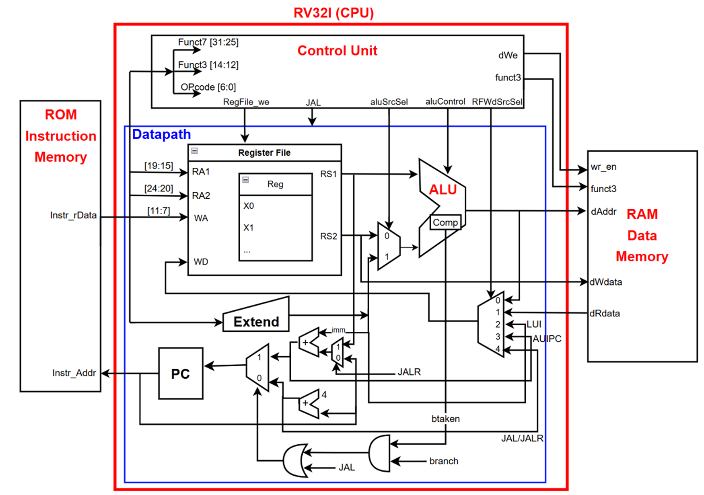
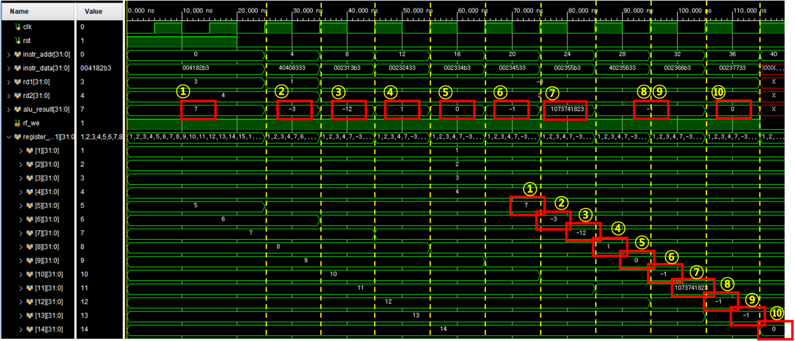
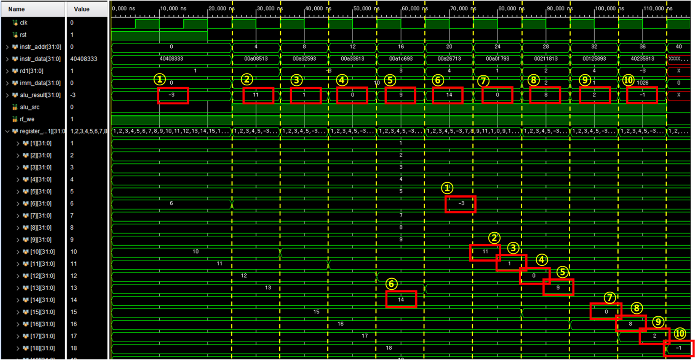
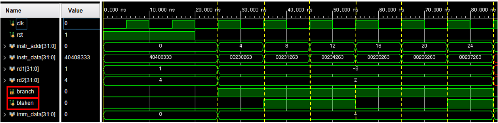

# 🧠 RISC-V RV32I Single Cycle CPU 설계 및 검증

> RISC-V RV32I 명령어 집합을 기반으로 Datapath와 Control Unit을 설계하고,  
> 명령어 타입별 시뮬레이션을 통해 동작을 검증한 개인 프로젝트입니다.

---

## 📌 프로젝트 개요

RISC-V의 32비트 정수형 기본 명령어 집합인 RV32I를 기반으로  
하나의 클럭 사이클 안에서 명령어를 처리하는 Single Cycle CPU를 설계했습니다.

Instruction Memory에서 명령어를 읽고, Control Unit이 Opcode와  
`funct3`, `funct7`을 해석하여 Datapath 내부의 Register File, ALU,  
Immediate Extend, Data Memory 및 PC 선택 회로를 제어하도록 구현했습니다.

R-Type, I-Type, S-Type, B-Type, U-Type, J-Type 명령어의 데이터 경로를 구성하고,  
명령어별 테스트 데이터를 ROM에 저장하여 연산 결과, 메모리 접근, 분기, 점프 및  
Register Write-back 동작을 시뮬레이션으로 검증했습니다.

---

## 👤 프로젝트 형태

**개인 프로젝트**

RV32I Single Cycle CPU의 전체 구조를 직접 설계하고,  
Datapath와 Control Unit 구현부터 명령어별 테스트 시나리오 구성 및  
시뮬레이션 파형 분석까지 수행했습니다.

---

## 🙋 주요 수행 내용

- RV32I Single Cycle CPU 전체 구조 설계
- Datapath 및 Control Unit 구현
- Program Counter와 Next PC 선택 로직 구성
- Register File Read/Write 구조 구현
- ALU 산술·논리·비교·Shift 연산 구현
- Immediate Extend 로직 구현
- R/I/S/B/U/J-Type 명령어 데이터 경로 구성
- Load/Store를 위한 Data Memory Interface 구현
- Branch 및 JAL/JALR 점프 동작 구현
- 명령어별 ROM 테스트 데이터 작성
- 시뮬레이션 파형을 통한 연산 및 Write-back 검증
- C 코드와 Assembly 코드의 실행 흐름 비교 분석

---

## 🛠 사용 기술

### HDL

- Verilog HDL
- SystemVerilog

### Processor Architecture

- RISC-V
- RV32I
- Single Cycle CPU
- Datapath
- Control Unit
- Register File
- ALU
- Program Counter

### Verification

- Testbench
- Functional Simulation
- Waveform Analysis
- Instruction-Level Verification

### Tools

- Vivado

---

## 🏗 시스템 구성

CPU는 Instruction Memory에서 명령어를 Fetch하고,  
Control Unit이 명령어의 Opcode와 Function Field를 해석하여 Datapath를 제어합니다.

Datapath는 Register File에서 Operand를 읽고,  
ALU 연산 또는 Data Memory 접근을 수행한 뒤 결과를 목적지 Register에 Write-back합니다.

```text
Instruction Memory
        ↓
 Instruction Decode
        ↓
   Control Unit
        ↓
┌─────────────────────────────┐
│          Datapath           │
│                             │
│ PC → Register File → ALU    │
│          ↓          ↓       │
│     Immediate    Data Memory│
│          ↓          ↓       │
│       Write-back MUX        │
└─────────────────────────────┘
        ↓
    Next PC Update
```

<p align="center">
  
</p>

<p align="center">
  <b>RV32I Single Cycle CPU 전체 Block Diagram</b>
</p>

---

## 🧩 주요 모듈

### Program Counter

- 현재 실행 중인 명령어 주소 저장
- 기본적으로 `PC + 4` 수행
- Branch 또는 Jump 발생 시 Target Address 선택
- 다음 클럭 상승 에지에서 새로운 PC 값 반영

### Instruction Memory

- PC 값을 기반으로 32비트 명령어 출력
- 명령어 검증을 위한 테스트 프로그램 저장
- 명령어가 저장된 ROM 형태로 구성

### Register File

- 32개의 32비트 Register 구성
- `rs1`, `rs2`를 통해 두 개의 Operand Read
- `rd`를 통해 연산 결과 Write-back
- `x0` Register는 항상 `0` 유지

### ALU

- 산술 연산: ADD, SUB
- 논리 연산: AND, OR, XOR
- Shift 연산: SLL, SRL, SRA
- 비교 연산: SLT, SLTU
- Branch 조건 비교
- Load/Store Address 계산

### Immediate Extend

명령어 타입에 따라 분리된 Immediate Field를 재배치하고,  
32비트 값으로 Sign Extension하여 ALU와 PC 계산에 전달합니다.

### Data Memory

- Load 명령어의 Read Data 출력
- Store 명령어의 Write Data 저장
- Byte, Half-Word, Word 단위 데이터 처리
- 주소와 제어 신호에 따라 Read/Write 동작 수행

### Control Unit

Opcode, `funct3`, `funct7`을 해석하여 다음 제어 신호를 생성합니다.

- Register File Write Enable
- ALU Source Select
- ALU Control
- Data Memory Write Enable
- Write-back Source Select
- Branch Control
- JAL / JALR Control
- Next PC Select

---

## 📚 지원 명령어

### R-Type

Register에 저장된 두 Operand를 이용하여  
산술, 논리, Shift 및 비교 연산을 수행합니다.

| 구분 | 지원 명령어 |
| --- | --- |
| Arithmetic | `ADD`, `SUB` |
| Shift | `SLL`, `SRL`, `SRA` |
| Compare | `SLT`, `SLTU` |
| Logic | `XOR`, `OR`, `AND` |

```text
rs1 ─┐
     ├── ALU ──→ rd
rs2 ─┘
```

---

### I-Type

Register 값과 Immediate를 이용한 연산 또는  
Data Memory의 값을 읽는 Load 명령어를 수행합니다.

| 구분 | 지원 명령어 |
| --- | --- |
| Arithmetic / Logic | `ADDI`, `SLTI`, `SLTIU`, `XORI`, `ORI`, `ANDI` |
| Shift | `SLLI`, `SRLI`, `SRAI` |
| Load | `LB`, `LH`, `LW`, `LBU`, `LHU` |
| Jump | `JALR` |

```text
rs1 ─────┐
         ├── ALU ──→ rd
Immediate┘
```

---

### S-Type

Register에 저장된 데이터를  
계산된 Data Memory 주소에 저장합니다.

| 지원 명령어 |
| --- |
| `SB`, `SH`, `SW` |

```text
Address = rs1 + Immediate
Memory[Address] = rs2
```

---

### B-Type

두 Register 값을 비교하고 조건을 만족하면  
PC를 Branch Target Address로 변경합니다.

| 지원 명령어 |
| --- |
| `BEQ`, `BNE`, `BLT`, `BGE`, `BLTU`, `BGEU` |

```text
Branch Target = PC + Immediate

조건 만족   → PC = Branch Target
조건 불만족 → PC = PC + 4
```

---

### U-Type

20비트 Immediate를 Register 상위 비트에 저장하거나  
현재 PC 값과 더하여 주소를 생성합니다.

| 지원 명령어 | 동작 |
| --- | --- |
| `LUI` | Immediate를 상위 20비트에 저장 |
| `AUIPC` | PC와 상위 Immediate를 더해 Register에 저장 |

---

### J-Type

조건 없이 Target Address로 점프하고,  
복귀 주소인 `PC + 4`를 목적지 Register에 저장합니다.

| 지원 명령어 |
| --- |
| `JAL` |

```text
rd = PC + 4
PC = Jump Target
```

---

## 🔄 명령어 처리 흐름

Single Cycle CPU는 하나의 클럭 사이클 안에서  
명령어 처리에 필요한 모든 과정을 수행합니다.

```text
Instruction Fetch
        ↓
Instruction Decode
        ↓
Register Read
        ↓
ALU Operation
        ↓
Memory Access
        ↓
Register Write-back
        ↓
PC Update
```

모든 단계가 하나의 클럭 사이클 안에서 수행되므로  
클럭 주기는 가장 긴 명령어의 Critical Path를 기준으로 결정됩니다.

---

## ✨ 주요 구현 내용

### 1. 명령어 타입별 Datapath 구성

명령어 타입마다 사용하는 Operand와 결과 경로가 다르기 때문에  
MUX 선택 신호를 이용해 ALU 입력, Write-back 데이터 및 Next PC를 결정했습니다.

### 2. ALU Control 설계

Opcode와 `funct3`, `funct7` 조합을 해석하여  
명령어별로 적절한 ALU 연산이 수행되도록 구성했습니다.

### 3. Immediate 생성

RISC-V 명령어 내부에서 분리된 Immediate Field를  
명령어 타입에 맞게 재배치하고 Sign Extension하여 사용했습니다.

### 4. Branch 및 Jump 제어

- ALU 비교 결과를 이용한 Branch Taken 판단
- Branch Target Address 계산
- JAL Target Address 계산
- JALR의 Register 기반 Target Address 계산
- `PC + 4` 복귀 주소 Write-back

### 5. Load / Store 처리

- Byte, Half-Word, Word 단위 Store 지원
- Byte, Half-Word, Word 단위 Load 지원
- Signed Load의 Sign Extension
- Unsigned Load의 Zero Extension
- Address 하위 비트를 이용한 데이터 위치 선택

---

## 🧪 시뮬레이션 검증

명령어 타입별 테스트 프로그램을 Instruction Memory에 저장하고,  
시뮬레이션 파형을 통해 PC, Instruction, ALU Result, Register Write-back 및  
Data Memory 신호가 예상대로 동작하는지 확인했습니다.

### 검증 항목

- 명령어 Fetch 및 PC 증가
- Opcode와 Function Field 해석
- Register File Operand Read
- ALU 연산 결과
- Immediate Sign Extension
- Register Write-back
- Data Memory Read/Write
- Branch 조건 판단
- Branch Target Address 이동
- JAL 및 JALR 동작
- Signed / Unsigned 연산 구분

---

## 📊 검증 결과

### R-Type ALU 연산 검증

<p align="center">
  
</p>

<p align="center">
  <b>R-Type 산술·논리·Shift·비교 연산 및 Register Write-back 결과</b>
</p>

`ADD`, `SUB`, `SLL`, `SRL`, `SRA`, `SLT`, `SLTU`,  
`XOR`, `OR`, `AND` 명령어를 순서대로 실행했습니다.

ALU 연산 결과가 명령어에 따라 정상적으로 계산되고,  
목적지 Register에 올바르게 Write-back되는 것을 확인했습니다.

| 명령어 | 검증 내용 |
| --- | --- |
| `ADD`, `SUB` | 산술 연산 결과 확인 |
| `SLL`, `SRL`, `SRA` | Shift 방식에 따른 결과 확인 |
| `SLT`, `SLTU` | Signed / Unsigned 비교 결과 확인 |
| `XOR`, `OR`, `AND` | 비트 단위 논리 연산 결과 확인 |

---

### I-Type 연산 및 Load 검증

<p align="center">
  
</p>

<p align="center">
  <b>I-Type Immediate 연산 및 Load 명령어 검증 결과</b>
</p>

Immediate를 사용하는 산술·논리·Shift 명령어와  
Data Memory의 값을 읽는 Load 명령어를 실행했습니다.

Immediate Field가 32비트로 정상 확장되고,  
ALU 연산 결과와 Memory Read Data가 목적지 Register에  
올바르게 Write-back되는 것을 확인했습니다.

| 구분 | 검증 내용 |
| --- | --- |
| Immediate 연산 | Immediate 확장 및 ALU 연산 결과 확인 |
| Shift Immediate | Shift Amount에 따른 연산 결과 확인 |
| Signed Load | Sign Extension 결과 확인 |
| Unsigned Load | Zero Extension 결과 확인 |
| Write-back | ALU 또는 Memory 결과의 Register 저장 확인 |

---

### B-Type 조건 분기 검증

<p align="center">
  
</p>

<p align="center">
  <b>B-Type 조건 비교 및 Branch Target Address 이동 결과</b>
</p>

`BEQ`, `BNE`, `BLT`, `BGE`, `BLTU`, `BGEU` 명령어를 실행하여  
두 Register의 비교 결과에 따른 PC 변경 동작을 검증했습니다.

조건이 만족되면 PC가 Branch Target Address로 변경되고,  
조건이 만족되지 않으면 다음 명령어 주소인 `PC + 4`로  
정상 이동하는 것을 확인했습니다.

| 구분 | 검증 내용 |
| --- | --- |
| Equal / Not Equal | `BEQ`, `BNE` 분기 조건 확인 |
| Signed Compare | `BLT`, `BGE` 결과 확인 |
| Unsigned Compare | `BLTU`, `BGEU` 결과 확인 |
| PC Control | 조건에 따른 Branch Target 선택 확인 |

---

## ✅ 전체 검증 결과

- R-Type 산술·논리·Shift·비교 연산 정상 동작
- I-Type Immediate 연산 및 Load 동작 정상 수행
- S-Type Byte, Half-Word, Word Store 동작 확인
- B-Type 조건 비교 및 PC 분기 동작 확인
- U-Type 상위 Immediate 처리 확인
- JAL 및 JALR Target Address 이동 확인
- `PC + 4` 복귀 주소 저장 확인
- Register File Write-back 정상 동작
- Data Memory Read/Write 정상 동작
- 명령어 실행 후 PC 정상 갱신 확인

---

## ⚠️ 문제 해결

### Signed / Unsigned 비교 구분

<table>
  <tr>
    <th width="120">구분</th>
    <th>내용</th>
  </tr>
  <tr>
    <td align="center"><b>문제</b></td>
    <td><code>SLT</code>와 <code>SLTU</code>, Signed Branch와 Unsigned Branch에서 비교 결과가 잘못 출력될 수 있음</td>
  </tr>
  <tr>
    <td align="center"><b>원인</b></td>
    <td>동일한 비트 패턴이라도 Signed 값과 Unsigned 값의 해석 방식이 다름</td>
  </tr>
  <tr>
    <td align="center"><b>해결</b></td>
    <td>명령어 종류에 따라 Signed 비교와 Unsigned 비교 연산을 분리하여 구현</td>
  </tr>
  <tr>
    <td align="center"><b>결과</b></td>
    <td><code>SLT</code>, <code>SLTU</code> 및 Branch 명령어별 비교 결과를 정상적으로 검증</td>
  </tr>
</table>

### Shift 연산의 부호 처리

<table>
  <tr>
    <th width="120">구분</th>
    <th>내용</th>
  </tr>
  <tr>
    <td align="center"><b>문제</b></td>
    <td><code>SRL</code>과 <code>SRA</code>에서 음수 데이터의 Shift 결과가 다르게 처리되어야 함</td>
  </tr>
  <tr>
    <td align="center"><b>원인</b></td>
    <td><code>SRL</code>은 빈 비트를 0으로 채우고, <code>SRA</code>는 부호 비트를 유지해야 함</td>
  </tr>
  <tr>
    <td align="center"><b>해결</b></td>
    <td>논리 우측 Shift와 산술 우측 Shift 연산을 ALU 내부에서 구분하여 구현</td>
  </tr>
  <tr>
    <td align="center"><b>결과</b></td>
    <td>음수 데이터에 대한 <code>SRL</code>과 <code>SRA</code> 결과가 각각 정상적으로 출력됨</td>
  </tr>
</table>

### Branch PC 선택 제어

<table>
  <tr>
    <th width="120">구분</th>
    <th>내용</th>
  </tr>
  <tr>
    <td align="center"><b>문제</b></td>
    <td>Branch 조건 결과와 PC 선택 신호가 정확히 연결되지 않으면 잘못된 명령어 주소로 이동할 수 있음</td>
  </tr>
  <tr>
    <td align="center"><b>원인</b></td>
    <td>Branch 명령어마다 비교 조건이 다르며, 조건 결과에 따라 Next PC 선택이 변경되어야 함</td>
  </tr>
  <tr>
    <td align="center"><b>해결</b></td>
    <td>Branch 조건 판단 결과와 Branch Control 신호를 조합하여 <code>PC + 4</code> 또는 Branch Target을 선택</td>
  </tr>
  <tr>
    <td align="center"><b>결과</b></td>
    <td>조건 만족 여부에 따라 PC가 순차 주소 또는 Branch Target으로 정상 변경됨</td>
  </tr>
</table>

---

## 📂 프로젝트 구조

```text
rv32i-single-cycle-cpu/
├── README.md
├── rtl/
│   ├── top_rv32i.sv
│   ├── control_unit.sv
│   ├── datapath.sv
│   ├── register_file.sv
│   ├── alu.sv
│   ├── immediate_extend.sv
│   ├── instruction_memory.sv
│   └── data_memory.sv
├── simulation/
│   ├── testbench/
│   └── test_program/
├── images/
│   ├── rv32i_single_cycle_block_diagram.png
│   ├── rv32i_rtype_waveform.png
│   ├── rv32i_itype_waveform.png
│   └── rv32i_btype_waveform.png
└── docs/
```

> 소스코드 업로드 후 실제 파일명과 폴더 구조에 맞게 수정할 예정입니다.

---

## 💡 프로젝트를 통해 배운 점

RV32I 명령어가 하드웨어 내부에서 어떤 데이터 경로를 따라 실행되는지 직접 설계하며  
CPU의 기본 구조와 명령어 처리 과정을 이해할 수 있었습니다.

특히 Opcode와 Function Field를 기반으로 Control Signal을 생성하고,  
MUX를 이용해 명령어별 Operand와 Write-back 경로를 선택하는 과정에서  
Datapath와 Control Unit의 관계를 구체적으로 파악했습니다.

또한 Signed/Unsigned 비교, Logical/Arithmetic Shift, Immediate 확장,  
Load/Store 데이터 크기 처리 및 Branch 조건에 따른 PC 변경을  
시뮬레이션 파형으로 검증하며 명령어 수준의 기능 검증 경험을 쌓았습니다.

Single Cycle CPU는 구조가 직관적이라는 장점이 있지만,  
모든 명령어 처리가 하나의 클럭 사이클 안에서 이루어지기 때문에  
가장 긴 Critical Path가 전체 동작 속도를 결정한다는 점도 이해할 수 있었습니다.
